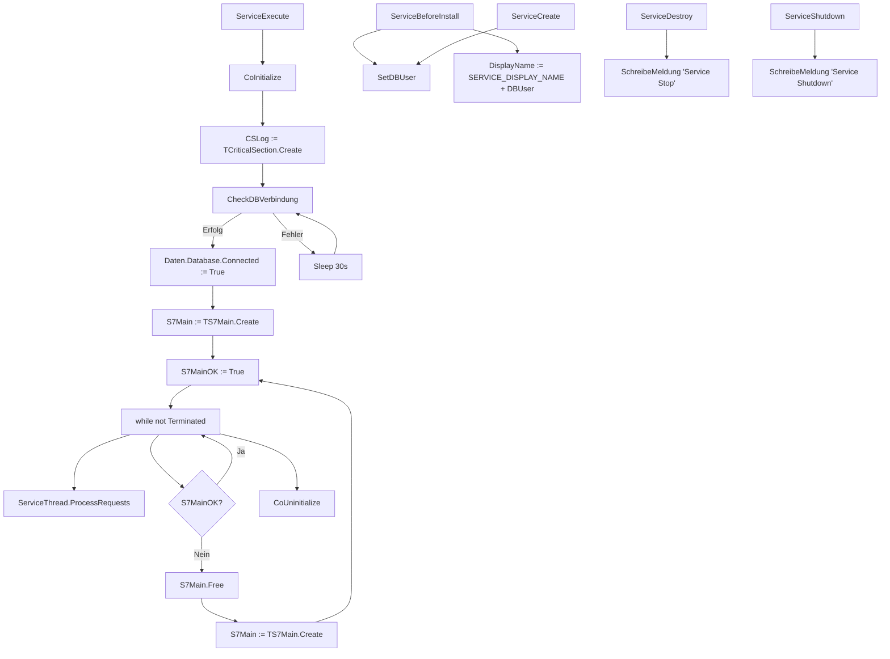
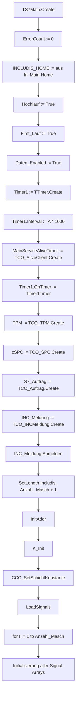
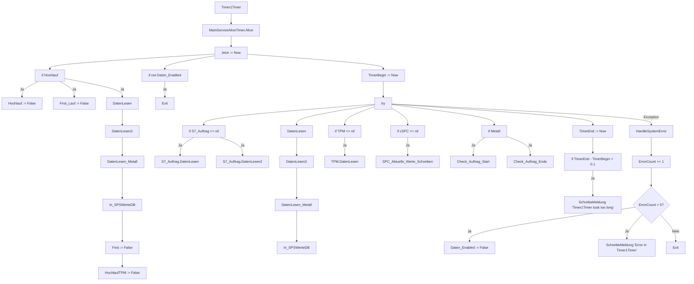
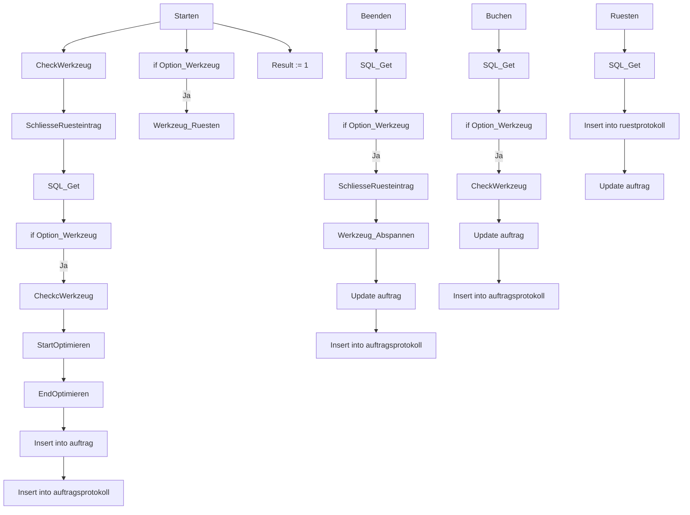
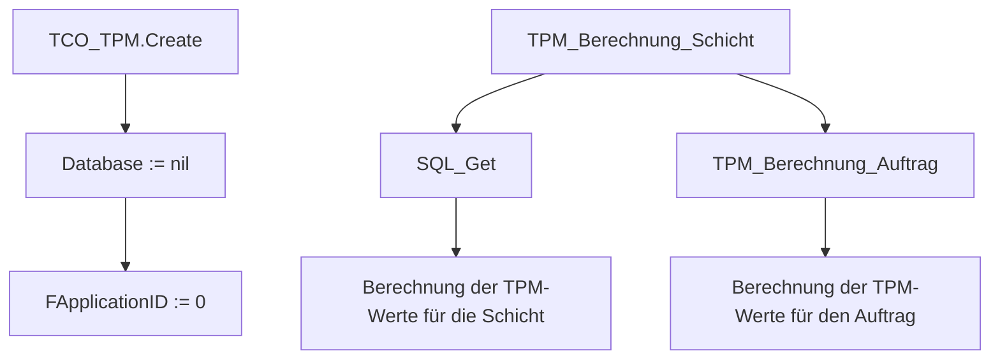
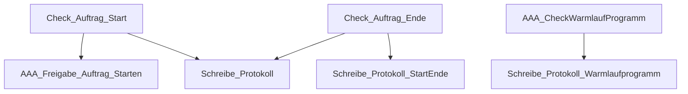

# 📋 INCLService & Komponenten_V63 - Funktionsaufruf-Diagramm

**Erstellt am:** `$(date)`
**Zweck:** Übersicht über alle Funktionen, deren Aufrufreihenfolge und auslösende Ereignisse in den Verzeichnissen `INCLService` und `Komponenten_V63`.

---

## 📌 Inhaltsverzeichnis

1. [Service-Lifecycle](#1-service-lifecycle)
2. [TS7Main: Initialisierung und Timer1Timer](#2-ts7main-initialisierung-und-timer1timer)
3. [Datenverarbeitung (DatenLesen, DatenLesen2, In_SPSWerteDB)](#3-datenverarbeitung)
4. [Schichtwechsel-Prozess](#4-schichtwechsel-prozess)
5. [Thread_Schicht](#5-thread_schicht)
6. [Thread_Zusatz](#6-thread_zusatz)
7. [Auftragsverwaltung (CO_Auftrag_V63)](#7-auftragsverwaltung-co_auftrag_v63)
8. [TPM-Funktionen (CO_TPM_V63)](#8-tpm-funktionen-co_tpm_v63)
9. [Metall-Verarbeitung (U_Metall)](#9-metall-verarbeitung-u_metall)
10. [Wichtige Hilfsfunktionen](#10-wichtige-hilfsfunktionen)
11. [Ereignisgesteuerte Funktionen](#11-ereignisgesteuerte-funktionen)
12. [Zusammenfassung der Aufrufreihenfolgen](#12-zusammenfassung-der-aufrufreihenfolgen)

---

## 1. Service-Lifecycle

### 📌 Hauptprogrammfluss (Main.pas)



---

## 2. TS7Main: Initialisierung und Timer1Timer

### 📌 2.1. TS7Main.Create (Konstruktor)



---

### 📌 2.2. Timer1Timer (Hauptzyklus - Detailliert)



---

## 3. Datenverarbeitung

### 📌 3.1. DatenLesen (Detaillierte Datenverarbeitung)

```mermaid
graph TD
    %% DatenLesen
    A3[DatenLesen] --> B3[if not Daten_Enabled]
    B3 -->|Ja| C3[Exit]
    B3 -->|Nein| D3[Jetzt := Now]
    D3 --> E3[if First]
    E3 -->|Ja| F3[First := False]
    E3 -->|Ja| G3[Hochlauf := True]
    E3 -->|Ja| H3[HochlaufTPM := True]
    
    D3 --> I3[for I := 1 to Anzahl_Masch]
    I3 --> J3[{Includis[I].IstArchiviert?}]
    J3 -->|Ja| K3[Continue]
    J3 -->|Nein| L3[Masch := TTT_GetMaschine(I)]
    
    L3 --> M3[if BCD_Schalter]
    M3 -->|Ja| N3[BCD_Read(I).Istwert := ...]
    
    L3 --> O3[if HandAuto(I).Istwert]
    O3 -->|Ja| P3[MaschProgrammbetrieb(I).Istwert := ...]
    
    L3 --> Q3[StueckGesamt[I].Istwert := ...]
    Q3 --> R3[StueckAuftragGesamt[I].Istwert := ...]
    R3 --> S3[StueckAuftragSchicht[I].Istwert := ...]
    S3 --> T3[StueckSchicht[I].Istwert := ...]
    T3 --> U3[Betriebsstunden[I].Istwert := ...]
    U3 --> V3[Taktzeit[I].Istwert := ...]
    V3 --> W3[LaufzeitGes[I].Istwert := ...]
    W3 --> X3[LaufzeitSchicht[I].Istwert := ...]
    
    L3 --> Y3[Maschinen_Zustand[I].Istwert := ...]
    Y3 --> Z3[Terminal_AuftragNr[I].Istwert := ...]
    Z3 --> AA3[Terminal_Menge_Gebucht[I].Istwert := ...]
    AA3 --> AB3[Terminal_Stillstand_Gebucht[I].Istwert := ...]
    
    L3 --> AC3[if SPC]
    AC3 -->|Ja| AD3[SPC_Signal[I].Istwert := ...]
    
    L3 --> AE3[if Metall]
    AE3 -->|Ja| AF3[Check_Auftrag_Start]
    AE3 -->|Ja| AG3[Check_Auftrag_Ende]
    
    L3 --> AH3[if Warmtrennen]
    AH3 -->|Ja| AI3[MaschWarmtrennen[I].Istwert := ...]
    
    L3 --> AJ3[if SpannzeitUeberwachen]
    AJ3 -->|Ja| AK3[SpannzeitSumme[I].Istwert := ...]
    AK3 --> AL3[SpannzeitAktuell[I].Istwert := ...]
    
    L3 --> AM3[if KavitaetFromSPS]
    AM3 -->|Ja| AN3[SPSKavitaet[I].Istwert := ...]
```

---

### 📌 3.2. DatenLesen2 (Erweiterte Datenverarbeitung)

```mermaid
graph TD
    %% DatenLesen2
    A4[DatenLesen2] --> B4[if not Daten_Enabled]
    B4 -->|Ja| C4[Exit]
    
    B4 -->|Nein| D4[for I := 1 to Anzahl_Masch]
    D4 --> E4[if Includis[I].IstArchiviert]
    E4 -->|Ja| F4[Continue]
    
    E4 -->|Nein| G4[if BCD[I].Istwert <> BCD[I].Altwert]
    G4 -->|Ja| H4[BCD_Read[I].Istwert := True]
    G4 -->|Ja| I4[BCD[I].Altwert := BCD[I].Istwert]
    
    E4 --> J4[if BCD_Read[I].Istwert]
    J4 -->|Ja| K4[BCD_Read[I].Istwert := False]
    J4 -->|Ja| L4[if BCD_Schalter]
    L4 -->|Ja| M4[Auftrag_Starten_BCDCode I]
    
    E4 --> N4[if HandAuto[I].Istwert <> HandAuto[I].Altwert]
    N4 -->|Ja| O4[HandAuto[I].Altwert := HandAuto[I].Istwert]
    
    E4 --> P4[if Maschinen_Zustand[I].Istwert <> Maschinen_Zustand[I].Altwert]
    P4 -->|Ja| Q4[Maschinen_Zustand[I].Altwert := Maschinen_Zustand[I].Istwert]
    P4 -->|Ja| R4[if Maschinen_Status_Schreiben]
    R4 -->|Ja| S4[Schreibe_SPS_Wert I, CMASCHINEN_STATUS, Maschinen_Zustand[I].Istwert]
    
    E4 --> T4[if Terminal_AuftragNr[I].Istwert <> Terminal_AuftragNr[I].Altwert]
    T4 -->|Ja| U4[Terminal_AuftragNr[I].Altwert := Terminal_AuftragNr[I].Istwert]
    
    E4 --> V4[if Terminal_Menge_Gebucht[I].Istwert]
    V4 -->|Ja| W4[Terminal_Menge_Gebucht[I].Istwert := False]
    V4 -->|Ja| X4[Menge_Gebucht I]
    
    E4 --> Y4[if Terminal_Stillstand_Gebucht[I].Istwert]
    Y4 -->|Ja| Z4[Terminal_Stillstand_Gebucht[I].Istwert := False]
    Y4 -->|Ja| AA4[Stillstand_Gebucht I]
    
    E4 --> AB4[if Terminal_Auftrag_Beendet[I].Istwert]
    AB4 -->|Ja| AC4[Terminal_Auftrag_Beendet[I].Istwert := False]
    AB4 -->|Ja| AD4[Auftrag_Ende I]
    
    E4 --> AE4[if Terminal_Auftrag_Unterbrochen[I].Istwert]
    AE4 -->|Ja| AF4[Terminal_Auftrag_Unterbrochen[I].Istwert := False]
    AE4 -->|Ja| AG4[Auftrag_Unterbrechen I]
```

---

### 📌 3.3. In_SPSWerteDB (Datenbank-Schreiboperationen)

```mermaid
graph TD
    %% In_SPSWerteDB
    A5[In_SPSWerteDB] --> B5[for I := 1 to Anzahl_Masch]
    B5 --> C5[if Includis[I].IstArchiviert]
    C5 -->|Ja| D5[Continue]
    
    C5 -->|Nein| E5[if StueckGesamt[I].Istwert <> StueckGesamt[I].Altwert]
    E5 -->|Ja| F5[Schreibe_SPS_Wert I, CSTUECKGESAMT, StueckGesamt[I].Istwert]
    E5 -->|Ja| G5[StueckGesamt[I].Altwert := StueckGesamt[I].Istwert]
    
    C5 --> H5[if StueckAuftragGesamt[I].Istwert <> StueckAuftragGesamt[I].Altwert]
    H5 -->|Ja| I5[Schreibe_SPS_Wert I, CSTUECKAUFTRAGGESAMT, StueckAuftragGesamt[I].Istwert]
    H5 -->|Ja| J5[StueckAuftragGesamt[I].Altwert := StueckAuftragGesamt[I].Istwert]
    
    C5 --> K5[if StueckAuftragSchicht[I].Istwert <> StueckAuftragSchicht[I].Altwert]
    K5 -->|Ja| L5[Schreibe_SPS_Wert I, CSTUECKAUFTRAGSCHICHT, StueckAuftragSchicht[I].Istwert]
    K5 -->|Ja| M5[StueckAuftragSchicht[I].Altwert := StueckAuftragSchicht[I].Istwert]
    
    C5 --> N5[if StueckSchicht[I].Istwert <> StueckSchicht[I].Altwert]
    N5 -->|Ja| O5[Schreibe_SPS_Wert I, CSTUECKSCHICHT, StueckSchicht[I].Istwert]
    N5 -->|Ja| P5[StueckSchicht[I].Altwert := StueckSchicht[I].Istwert]
    
    C5 --> Q5[if Betriebsstunden[I].Istwert <> Betriebsstunden[I].Altwert]
    Q5 -->|Ja| R5[Schreibe_SPS_Wert I, CBETRIEBSSTUNDEN, Betriebsstunden[I].Istwert]
    Q5 -->|Ja| S5[Betriebsstunden[I].Altwert := Betriebsstunden[I].Istwert]
    
    C5 --> T5[if Taktzeit[I].Istwert <> Taktzeit[I].Altwert]
    T5 -->|Ja| U5[Schreibe_SPS_Wert I, CTAKTZEIT, Taktzeit[I].Istwert]
    T5 -->|Ja| V5[Taktzeit[I].Altwert := Taktzeit[I].Istwert]
```

---

## 4. Schichtwechsel-Prozess

### 📌 4.1. StartSchichtWechsel (Schichtwechsel-Logik)

```mermaid
graph TD
    %% StartSchichtWechsel
    A7[StartSchichtWechsel] --> B7[SchreibeMeldung 'Schichtwechsel gestartet']
    B7 --> C7[AlteSchicht := Schicht]
    C7 --> D7[Schicht := GetShiftNo Shift_Model, Jetzt]
    D7 --> E7[if Schicht <> AlteSchicht]
    E7 -->|Ja| F7[SchreibeMeldung 'Schichtwechsel von ' + IntToStr(AlteSchicht) + ' nach ' + IntToStr(Schicht)]
    E7 -->|Ja| G7[NeueSchicht AlteSchicht]
    G7 -->|True| H7[SchichtSpeicher := Schicht]
    H7 --> I7[for I := 1 to Anzahl_Masch]
    I7 --> J7[if Includis[I].IstArchiviert]
    J7 -->|Ja| K7[Continue]
    J7 -->|Nein| L7[StueckSchicht[I].Altwert := StueckSchicht[I].Istwert]
    L7 --> M7[StueckSchicht[I].Istwert := 0]
    L7 --> N7[StueckAuftragSchicht[I].Altwert := StueckAuftragSchicht[I].Istwert]
    N7 --> O7[StueckAuftragSchicht[I].Istwert := 0]
    L7 --> P7[LaufzeitSchicht[I].Altwert := LaufzeitSchicht[I].Istwert]
    P7 --> Q7[LaufzeitSchicht[I].Istwert := 0]
    
    E7 -->|Ja| R7[if SPC]
    R7 -->|Ja| S7[SPC_Init]
    
    E7 -->|Ja| T7[if TPM_Auswertung]
    T7 -->|Ja| U7[TPM_Schicht_Schicht3]
```

---

## 5. Thread_Schicht

### 📌 5.1. Thread_Schicht.Execute

```mermaid
graph TD
    %% Thread_Schicht.Execute
    A6[Execute] --> B6[while not Terminated]
    B6 --> C6[WaitForSingleObject(Event_Schicht, INFINITE)]
    C6 --> D6[if Schicht_Berechnung]
    D6 -->|Ja| E6[Berechne_Stillstaende_Schicht Stillstaende_Schicht]
    D6 -->|Ja| F6[TPM_Schicht_Pruefen Stillstaende_Schicht]
    D6 -->|Ja| G6[TPM_Stillog_Korrektur]
    D6 -->|Ja| H6[Berechne_TPM_Auswertung]
    D6 -->|Ja| I6[TPM_AuswertungKorrektur]
    D6 -->|Ja| J6[Berechne_TPM_Produktionsdetail MaxSchichtTime]
    D6 -->|Ja| K6[Berechne_TPM_Auftragsdetail MaxSchichtTime]
    D6 -->|Ja| L6[Berechne_Extrusion]
    D6 -->|Ja| M6[Nachbuchen_aus_AArchiv Stillstaende_Schicht]
    D6 -->|Ja| N6[CheckLaufzeitLog]
    
    B6 --> O6[if Recalculate_Mode]
    O6 -->|Ja| P6[Recalculation]
    P6 --> Q6[Berechne_TPM_Korrektur]
    
    B6 --> R6[if NachBerechnung]
    R6 -->|Ja| S6[Berechne_TPM_Schicht_Verpackt_Ausschuss Stillstaende_Schicht]
    R6 -->|Ja| T6[Berechne_TPM_ProduktionsdetailDebug]
```

---

## 6. Thread_Zusatz

### 📌 6.1. Thread_Zusatz.Execute

```mermaid
graph TD
    %% Thread_Zusatz.Execute
    A8[Execute] --> B8[while not Terminated]
    B8 --> C8[WaitForSingleObject(Event_Zusatz, INFINITE)]
    C8 --> D8[StartProgramme]
    D8 --> E8[if ThreadZusatzTimer > 0]
    E8 -->|Ja| F8[if Now - ThreadZusatzLast > ThreadZusatzTimer / 86400]
    F8 -->|Ja| G8[ThreadZusatzLast := Now]
    F8 -->|Ja| H8[Palette_Rest_Berechnen]
    H8 --> I8[TPM_Korrektur_Doppelte_Daten]
    I8 --> J8[WZReparatur]
    I8 --> K8[Check_TaktLog]
    I8 --> L8[CalcPackedlogFromShiftlog]
    I8 --> M8[Book_Short_Delay]
    I8 --> N8[CheckRuestProt_Stillog]
    I8 --> O8[Laufzeit_Berechnen]
    I8 --> P8[Job_No_to_Downtime_Log]
    I8 --> Q8[CheckVerpacktProt]
    I8 --> R8[ArbeitsFrei_Buchen]
    I8 --> S8[Taktzeit_Personal]
    I8 --> T8[TaktMitteln True]
    I8 --> U8[UnscheduledSetup]
    I8 --> V8[CheckSollstueck]
    I8 --> W8[CheckWzWartungen]
    I8 --> X8[CheckAuftragKette]
    I8 --> Y8[BerechnenEndeausIst]
    I8 --> Z8[Laufende_Auftraege_Terminieren]
```

---

## 7. Auftragsverwaltung (CO_Auftrag_V63)

### 📌 7.1. CO_Auftrag Hauptfunktionen



---

## 8. TPM-Funktionen (CO_TPM_V63)

### 📌 8.1. CO_TPM Hauptfunktionen



---

## 9. Metall-Verarbeitung (U_Metall)

### 📌 9.1. U_Metall Hauptfunktionen



---

## 10. Wichtige Hilfsfunktionen

### 📌 10.1. Hilfsfunktionen (DBMain.pas)

```mermaid
graph TD
    %% Hilfsfunktionen
    A12[Schreibe_SPS_Wert] --> B12[if S7Typ = 1]
    B12 -->|Ja| C12[S7Main.Schreibe_SPS_Wert Maschnr, SignalNr, Wert]
    
    A12 --> D12[if S7Typ = 2]
    D12 -->|Ja| E12[S7Main2.Schreibe_SPS_Wert Maschnr, SignalNr, Wert]
    
    %% NeueSchicht
    F12[NeueSchicht] --> G12[if GetShiftNo Shift_Model, Jetzt <> AlteSchicht]
    G12 -->|Ja| H12[AlteSchicht := Schicht]
    H12 --> I12[Result := True]
    G12 -->|Nein| J12[Result := False]
    
    %% CheckRoteLampeAus
    K12[CheckRoteLampeAus] --> L12[if MerkerRoteLampe <> '']
    L12 -->|Ja| M12[Schreibe_SPS_Wert 0, TTT_GetSignalNr(CROTELAMPE_AUS), 1]
    L12 -->|Ja| N12[Schreibe_SPS_Wert 0, TTT_GetSignalNr(CROTELAMPE_AUS), 0]
    L12 -->|Ja| O12[Result := True]
    L12 -->|Nein| P12[Result := False]
```

---

## 11. Ereignisgesteuerte Funktionen

| **Ereignis** | **Auslöser** | **Funktion** | **Datei** |
|--------------|--------------|--------------|-----------|
| **ServiceExecute** | Dienst startet | Hauptzyklus | Main.pas |
| **Timer1Timer** | Timer-Intervall (standardmäßig 15s) | Datenlesen und -verarbeitung | DBMain.pas |
| **Event_Schicht** | Schichtwechsel erkannt | Berechnungen für neue Schicht | Th_Schicht.pas |
| **Event_Zusatz** | Zusatzfunktionen ausführen | Verschiedene Berechnungen | Th_Zusatz.pas |
| **Terminal_Menge_Gebucht** | Signal ändert sich | Menge_Gebucht | DBMain.pas |
| **Terminal_Stillstand_Gebucht** | Signal ändert sich | Stillstand_Gebucht | DBMain.pas |
| **Terminal_Auftrag_Beendet** | Signal ändert sich | Auftrag_Ende | DBMain.pas |
| **Terminal_Auftrag_Unterbrochen** | Signal ändert sich | Auftrag_Unterbrechen | DBMain.pas |
| **BCD_Read** | BCD-Schalter ändert sich | Auftrag_Starten_BCDCode | DBMain.pas |

---

## 12. Zusammenfassung der Aufrufreihenfolgen

### 📌 12.1. Service-Start und Initialisierung

```
ServiceExecute
├── CheckDBVerbindung
│   ├── TCO_Database.Create
│   ├── iData.Connected := True
│   └── SchreibeMeldung
├── TS7Main.Create
│   ├── Timer1.Create
│   ├── TCO_TPM.Create
│   ├── TCO_SPC.Create
│   ├── TCO_Auftrag.Create
│   ├── TCO_INCMeldung.Create
│   │   └── INC_Meldung.Anmelden
│   ├── InitAddr
│   ├── K_Init
│   ├── CCC_SetSchichtKonstante
│   └── LoadSignals
└── Create_Threads
    ├── Thread_Schicht.Create
    ├── Thread_Zusatz.Create
    └── Thread_SignalLog.Create
```

---

### 📌 12.2. Hauptzyklus (Timer1Timer)

```
Timer1Timer
├── MainServiceAliveTimer.Alive
├── Jetzt := Now
├── if Hochlauf
│   ├── Hochlauf := False
│   ├── First_Lauf := False
│   ├── DatenLesen
│   ├── DatenLesen2
│   ├── DatenLesen_Metall
│   ├── In_SPSWerteDB
│   ├── First := False
│   └── HochlaufTPM := False
├── if not Daten_Enabled → Exit
├── TimerBegin := Now
├── try
│   ├── if S7_Auftrag <> nil
│   │   ├── S7_Auftrag.DatenLesen
│   │   └── S7_Auftrag.DatenLesen2
│   ├── DatenLesen
│   │   └── for I := 1 to Anzahl_Masch
│   │       ├── BCD_Read
│   │       ├── HandAuto
│   │       ├── Maschinen_Zustand
│   │       ├── StueckGesamt, StueckAuftragGesamt, StueckSchicht
│   │       ├── Betriebsstunden, Taktzeit, LaufzeitGes, LaufzeitSchicht
│   │       ├── Terminal_AuftragNr, Terminal_Menge_Gebucht
│   │       ├── Check_Auftrag_Start (if Metall)
│   │       └── Check_Auftrag_Ende (if Metall)
│   ├── DatenLesen2
│   │   └── for I := 1 to Anzahl_Masch
│   │       ├── BCD_Read → Auftrag_Starten_BCDCode
│   │       ├── HandAuto → Altwert aktualisieren
│   │       ├── Maschinen_Zustand → Schreibe_SPS_Wert
│   │       ├── Terminal_AuftragNr → Altwert aktualisieren
│   │       ├── Terminal_Menge_Gebucht → Menge_Gebucht
│   │       ├── Terminal_Stillstand_Gebucht → Stillstand_Gebucht
│   │       ├── Terminal_Auftrag_Beendet → Auftrag_Ende
│   │       └── Terminal_Auftrag_Unterbrochen → Auftrag_Unterbrechen
│   ├── DatenLesen_Metall
│   ├── In_SPSWerteDB
│   │   └── for I := 1 to Anzahl_Masch
│   │       ├── StueckGesamt → Schreibe_SPS_Wert
│   │       ├── StueckAuftragGesamt → Schreibe_SPS_Wert
│   │       ├── StueckSchicht → Schreibe_SPS_Wert
│   │       └── Betriebsstunden, Taktzeit, LaufzeitGes, LaufzeitSchicht → Schreibe_SPS_Wert
│   ├── if TPM <> nil → TPM.DatenLesen
│   ├── if cSPC <> nil → SPC_Aktuelle_Werte_Schreiben
│   └── TimerEnd := Now
└── except → HandleSystemError
```

---

### 📌 12.3. Schichtwechsel-Prozess

```
NeueSchicht
├── GetShiftNo Shift_Model, Jetzt
├── if Schicht <> AlteSchicht
│   ├── SchreibeMeldung
│   ├── StartSchichtWechsel
│   │   ├── for I := 1 to Anzahl_Masch
│   │   │   ├── StueckSchicht[I].Altwert := StueckSchicht[I].Istwert
│   │   │   ├── StueckSchicht[I].Istwert := 0
│   │   │   ├── StueckAuftragSchicht[I].Altwert := StueckAuftragSchicht[I].Istwert
│   │   │   ├── StueckAuftragSchicht[I].Istwert := 0
│   │   │   └── LaufzeitSchicht[I].Altwert := LaufzeitSchicht[I].Istwert
│   │   │       └── LaufzeitSchicht[I].Istwert := 0
│   │   ├── if SPC → SPC_Init
│   │   └── if TPM_Auswertung → TPM_Schicht_Schicht3
│   └── Result := True
└── Result := False
```

---

### 📌 12.4. Thread_Zusatz-Prozess

```
StartProgramme
├── Palette_Rest_Berechnen
├── TPM_Korrektur_Doppelte_Daten
├── WZReparatur
├── Check_TaktLog
├── CalcPackedlogFromShiftlog
├── Book_Short_Delay
├── CheckRuestProt_Stillog
├── Laufzeit_Berechnen
├── Job_No_to_Downtime_Log
├── CheckVerpacktProt
├── ArbeitsFrei_Buchen
├── Taktzeit_Personal
├── TaktMitteln True
├── UnscheduledSetup
├── CheckSollstueck
├── CheckWzWartungen
├── CheckAuftragKette
├── BerechnenEndeausIst
└── Laufende_Auftraege_Terminieren
```

---

## 📝 Anhang: Wichtige Variablen und Konstanten

### 🔹 Globale Variablen (DBMain.pas)

| **Variable** | **Typ** | **Beschreibung** |
|--------------|---------|------------------|
| `Anzahl_Masch` | Integer | Anzahl der Maschinen |
| `Hochlauf` | Boolean | Hochlaufphase aktiv |
| `First_Lauf` | Boolean | Erster Durchlauf |
| `Daten_Enabled` | Boolean | Datenverarbeitung aktiv |
| `S7MainOK` | Boolean | S7Main läuft ohne Fehler |
| `Schicht` | Integer | Aktuelle Schicht |
| `AlteSchicht` | Integer | Vorherige Schicht |
| `Jetzt` | TDateTime | Aktuelle Zeit |

---

### 🔹 Wichtige Konstanten (DBMain.pas)

| **Konstante** | **Wert** | **Beschreibung** |
|--------------|----------|------------------|
| `TAGMINUTEN` | 1440 | Minuten pro Tag |
| `Stunde` | 1 / 24 | Stunde in TDateTime |
| `MINUTEN5` | 5 / TAGMINUTEN | 5 Minuten in TDateTime |
| `MINUTEN10` | 10 / TAGMINUTEN | 10 Minuten in TDateTime |
| `MINUTEN60` | Stunde | 60 Minuten in TDateTime |
| `Max_ANZAHL` | 600 | Maximale Anzahl Maschinen |
| `INC_Application` | 50 | Anwendungs-ID |

---

## 📌 Legende

- **→** : Aufruf einer Funktion
- **--->** : Bedingter Aufruf (wenn Bedingung erfüllt)
- **→|Ja|** : Aufruf bei erfüllter Bedingung
- **→|Nein|** : Aufruf bei nicht erfüllter Bedingung
- **...** : Fortsetzung der Logik
- **[]** : Funktion oder Prozedur
- **{}** : Bedingung oder Schleife

---

## 🖨️ Druckhinweise

1. **Seitenränder:** Stellen Sie sicher, dass die Seitenränder ausreichend groß sind, um die Diagramme vollständig darzustellen.
2. **Skalierung:** Falls die Diagramme zu groß sind, können Sie die Skalierung im Druckdialog auf **"An Seite anpassen"** setzen.
3. **Ausrichtung:** **Querformat** wird für die Diagramme empfohlen.
4. **Schriftgröße:** Verwenden Sie eine Schriftgröße von **10-12pt** für optimale Lesbarkeit.

---

**Ende des Dokuments**
